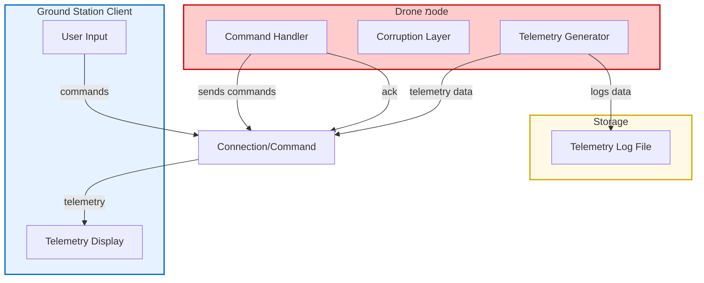

**Drone System Architecture**  (build guide below)

**Overview**

This is a **remote drone command and control system** consisting of two main components: a drone node and a ground-based control station that communicates with it.

***

**DroneNode**

The drone is a system with three internal components working together:

**Command Handler**

- **Function**: Parse the command coming to the drone
- **Role**: Listens for incoming commands from the ground station
- **Process**: Processes received commands and sends acknowledgment (ack) signals back to confirm message receipt
- **Importance**: Ensures the ground station knows commands were received

**Corruption Layer**

- **Function**: Processes or intentionally modifies telemetry data Simulates real-world sensor noise and corruption for testing robustness
- **Purpose**: Tests system resilience and data integrity

**Telemetry Generator**

- **Function**: The metrics of the drone
- **Role**: Collects sensor data from the drone, including:
- - Position (x y z)
  - Battery level
  - Orientation and heading
  - Speed and acceleration
  **Output**: Packages data into telemetry reports for transmission

**Telemetry Log File**

- **Function**: Local permanent record storage
- **Purpose**: Acts as a "black box" for the drone

***

**Ground Station Client (The Control Center)**

The ground operator's interface consists of two main elements:

**User Input**

- **Function**: Command interface for human operators
- **Capabilities**: Allows operators to send commands:
  - Takeoff
  - Landing
  - Stop
  - Go to direction

**Telemetry Display**

- **Function**: Real-time monitoring dashboard
- **Displays**:
  - Current drone position
  - Current speed
  - Altitude information
  - Sensor readings
  - System status
  - Battery level
  - Flight statistics

***

**Architecture preferrences**

using multithreaded server for 2 reasons:
1. preventing blocking between input and output
The commandLoop performs a recv call on the socket, which is a blocking operation: if the client does not send commands, the thread may be stuck inside recv for a long time.
Meanwhile, the telemetryLoop must continue sending telemetry every 100ms even when the client sends nothing. If both ran in the same thread, any time the code was blocked in recv, it would be impossible to send telemetry on time.

2. keeps telemetry rate
The telemetry runs at a fixed rate (10HZ sleep).
Commands may arrive in bursts, sometimes not at all, and sometimes require processing (for example, parsing of goto args).

***

***

**build project**

- cmake .
- make

**Run**
- sudo bring_up_isolated_IP.sh <drone_IP> <ground_base_IP> [port (default 5000)] 
- sudo ip netns exec GroundBase ./build/ground_base <drone_IP> <port>

